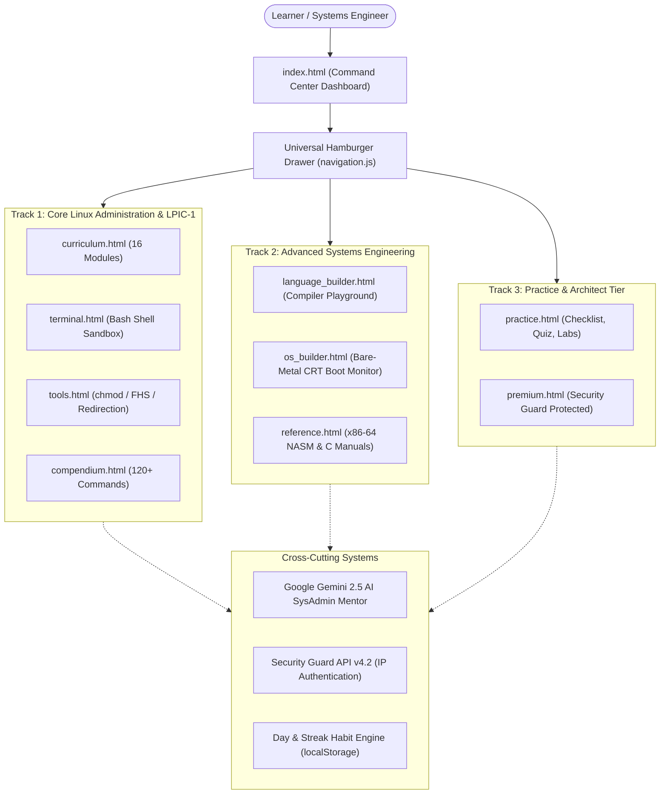
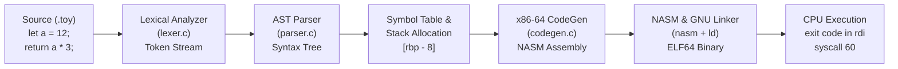
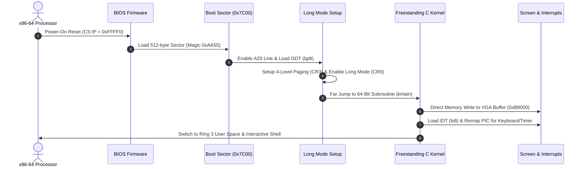
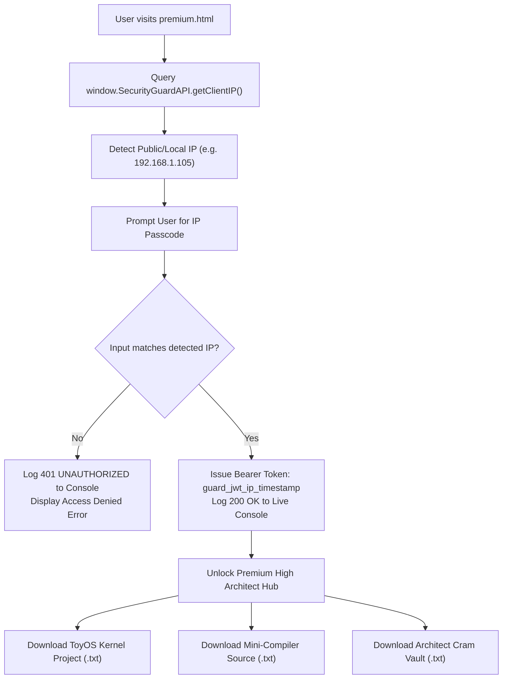

# LTSP • Linux & Operating Systems Master Training Programme

[-0ea5e9.svg)](https://github.com/alexhack235-code)
[](https://github.com/alexhack235-code/LTSP)
[](https://vercel.com/new/clone?repository-url=https%3A%2F%2Fgithub.com%2Falexhack235-code%2FLTSP)
[-f59e0b.svg)](https://www.lpi.org)
[](#-security-guard-api--premium-high-system)
[](#-google-gemini-ai-sysadmin-mentor)

> **Created and Engineered by Alexander ([@alexhack235-code](https://github.com/alexhack235-code))**  
> Official GitHub Repository: [https://github.com/alexhack235-code/LTSP](https://github.com/alexhack235-code/LTSP)

A complete, beginner-friendly, multi-page interactive web training platform designed to take anyone from zero Linux and computer science knowledge to:
1. Mastering modern Operating Systems fundamentals and conquering the **LPIC-1 (101-500 & 102-500 Version 5.0)** certification.
2. Building your first **Programming Language & Compiler** (from Lexer/Parser AST to native x86-64 NASM assembly code generation).
3. Building your first **Bare-Metal 64-Bit Operating System** (from 16-bit BIOS bootloader to 64-bit Long Mode C Kernel with VGA text buffer at `0xB8000`).

---

## 🎯 The Learning Pledge
> **"By the end of this training programme, you will have all the required foundational knowledge on modern operating systems, command-line operations, Linux system administration, storage architectures, networking, process lifecycles, and security — fully preparing you for LPIC-1 certification and real-world engineering roles."**

---

## 📊 Diagrammatic Architecture Layout

### 1. Platform & Navigation Topology
The training suite uses an uncluttered, multi-page layout connected through a universal animated hamburger drawer:



---

### 2. Track A: Compiler Engineering Pipeline (High-Level Code to Machine Code)
How our Toy Language translates human-readable statements into native Linux x86-64 machine instructions:



---

### 3. Track B: Bare-Metal 64-Bit OS Boot Architecture
The step-by-step transition from power-on reset through 16-bit Real Mode into 64-bit Long Mode:



---

### 4. Security Guard API: Dynamic IP-as-Password Authentication Flow
How the Security Guard engine authenticates users and secures architect-tier bundles:



---

## 🧭 Multi-Page & Tabbed Architecture (Hamburger System)

To ensure an uncluttered, focused learning experience, LTSP is organized into dedicated, lightning-fast standalone pages accessible via a universal **animated hamburger drawer menu**:

| Page | URL | Purpose & Capabilities |
| :--- | :--- | :--- |
| **Dashboard** | [`index.html`](index.html) | Central command hub, 45-day challenge, learning pledge & launchpads |
| **Curriculum** | [`curriculum.html`](curriculum.html) | 16 comprehensive LPIC-1 modules with copyable syntax & analogies |
| **Terminal** | [`terminal.html`](terminal.html) | Interactive in-browser bash terminal sandbox with quick launcher |
| **Visual Tools** | [`tools.html`](tools.html) | Octal `chmod` calculator, FHS tree, I/O redirection flow & signals matrix |
| **Language Builder** | [`language_builder.html`](language_builder.html) | 5-phase compiler roadmap + live in-browser compiler playground |
| **OS Builder** | [`os_builder.html`](os_builder.html) | 6-stage bare-metal OS roadmap + virtual VGA CRT boot monitor |
| **Reference Manuals**| [`reference.html`](reference.html) | Tabbed 23-section x86-64 NASM guide & 25-section Standard C guide |
| **Practice & Labs** | [`practice.html`](practice.html) | Tabbed 17-point checklist, 12-question quiz & 6 sysadmin missions |
| **Compendium** | [`compendium.html`](compendium.html) | Searchable dictionary of 120+ commands with 1-click clipboard copy |
| **Premium High System** | [`premium.html`](premium.html) | Security Guard API IP-as-password gate & kernel/compiler source bundles |

---

## 🔥 Day & Streak Counter (Daily Habit Tracker)
* **Streak Counter**: Automatically tracks consecutive days of study with browser `localStorage` persistence.
* **45-Day Systems Challenge**: Structured roadmap guiding you day-by-day from terminal beginner to systems architect.
* **1-Click Daily Check-In**: Check in once per day to maintain your streak and watch your 7-day visual dots advance.

---

## 🛡️ Security Guard API & Premium High System
* **IP-as-Password Authentication**: The master passcode dynamically matches the user's detected client IP address (resolved via `window.SecurityGuardAPI`).
* **Security Guard Live Audit Console**: Real-time packet inspection, WAF verification, and automated token generation.
* **Exportable Architect Bundles**:
  - 👑 **ToyOS 64-Bit Bare-Metal Kernel Project**: Complete package with `boot.asm`, `kernel.c`, and `Makefile` ready to run in QEMU.
  - 👑 **Mini-Language Compiler Project**: Full C source tree (`lexer.c`, `parser.c`, `codegen.c`) emitting native x86-64 NASM.
  - 👑 **Systems Architect Cram Vault**: System V AMD64 calling conventions, Linux syscall numbers, POSIX signal table, and octal cheat sheets.

---

## 🤖 Google Gemini AI SysAdmin & Architecture Mentor
* **Powered by Google Gemini 2.5 Flash**: Connected via the official Google Generative Language API.
* **Embedded AI Drawer**: Floating FAB button accessible across all pages.
* **Creator-Aware Systems Mentor**: Guided to support Alexander's curriculum, answer questions on Linux, C, Assembly, and OS architecture, and provide beginner-friendly code examples.

## ⚡ Instant Vercel Deployment

Deploy your own live instance of LTSP to the cloud in under 30 seconds with zero backend dependencies:

[](https://vercel.com/new/clone?repository-url=https%3A%2F%2Fgithub.com%2Falexhack235-code%2FLTSP)

### Option A: 1-Click Cloud Deployment (Recommended)
1. Click the **Deploy with Vercel** button above.
2. Sign in to your [Vercel](https://vercel.com) account (using your GitHub account).
3. Connect the repository [`alexhack235-code/LTSP`](https://github.com/alexhack235-code/LTSP) and click **Deploy**.
4. Vercel automatically detects `vercel.json` and publishes your live site to an edge-accelerated `.vercel.app` domain!

### Option B: Deploy via Vercel CLI
```bash
# Install Vercel CLI
npm install -g vercel

# Deploy from project directory
vercel

# Deploy straight to production
vercel --prod
```

### ⚙️ Vercel Architecture Features (`vercel.json`):
* **Clean URLs**: Clean extensionless paths (e.g. `/curriculum`, `/terminal`, `/os`, `/compiler`, `/reference`, `/practice`, `/compendium`, `/premium`).
* **Global Edge CDN**: Static scripts, CSS stylesheets, and assets cached with `max-age=31536000, immutable`.
* **Security Headers**: Standard `X-Content-Type-Options: nosniff`, `X-Frame-Options: SAMEORIGIN`, and `X-XSS-Protection`.

---

## 🚀 How to Run Locally

### Option 1: Instant Direct Open (No Server Required)
Simply double-click `index.html` or open it in any modern browser (Chrome, Edge, Firefox, Brave). All tools, terminal emulation, compiler playground, and calculators operate completely client-side!

### Option 2: Local Web Server
Run the included launcher `start_server.bat` or run:
```bash
python -m http.server 8000
```
Then navigate to: `http://localhost:8000`

---

## 📁 Repository Structure

```
LTSP/
├── index.html              # Command Center Dashboard & Launchpad
├── curriculum.html         # 16-Module LPIC-1 Master Curriculum
├── terminal.html           # In-Browser Linux Terminal Sandbox
├── tools.html              # Visual Calculators (Octal, FHS, Redirection, Signals)
├── language_builder.html   # Track A: Compiler Engineering + Live Playground
├── os_builder.html         # Track B: Bare-Metal OS + Virtual CRT Monitor
├── reference.html          # Assembly (x86-64) & Standard C Reference Manuals
├── practice.html           # 17-Point Checklist, 12-Question Quiz & 6 Trouble Labs
├── compendium.html         # 120+ Searchable Commands Table
├── premium.html            # Security Guard Protected Architect Tier
├── vercel.json             # Vercel deployment configuration & routing
├── README.md               # Project documentation & guides
├── start_server.bat        # Windows 1-click server launcher
├── start_server.py         # Python HTTP server script
├── css/
│   └── styles.css          # Cyber-terminal styling, hamburger animations, theme
├── js/
│   ├── data.js             # 16 Modules curriculum, 120+ commands, quiz, labs
│   ├── advanced_data.js    # Assembly manual, C manual, compiler & OS datasets
│   ├── navigation.js       # Universal hamburger drawer & navigation system
│   ├── terminal.js         # Interactive Linux terminal simulator
│   ├── app.js              # Curriculum, calculators, checklist & compendium logic
│   ├── advanced_app.js     # Streak tracker, compiler playground & OS boot engine
│   ├── security_guard.js   # Security Guard API client, IP authentication, bundles
│   └── ai_assistant.js     # Google Gemini AI mentor integration
└── assets/                 # Brand assets and graphics
```

---

## 👤 Author & Creator

**Alexander**
* GitHub: [@alexhack235-code](https://github.com/alexhack235-code)
* Repository: [https://github.com/alexhack235-code/LTSP](https://github.com/alexhack235-code/LTSP)

*Engineered with passion for aspiring sysadmins, kernel developers, and systems architects.*
